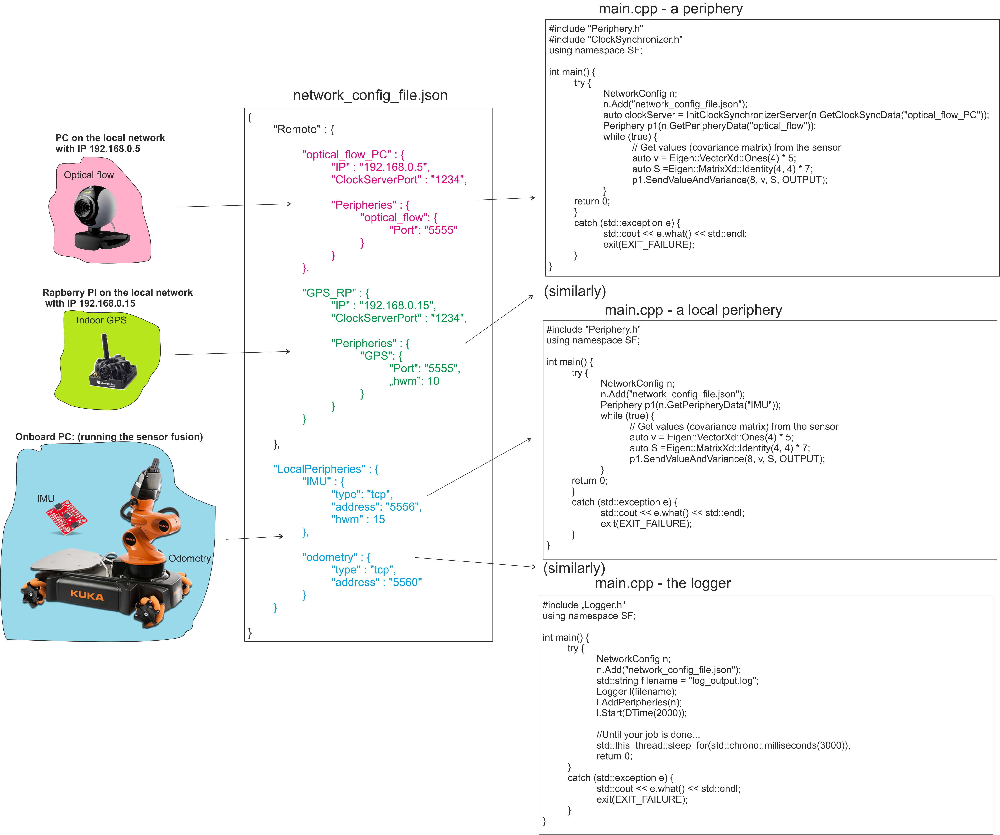

# SensorFusion library

[](https://travis-ci.org/joemccann/dillinger)


 The package provides 
  - Kalman filter-based centralized filtering methods and an interface to build complex sensor systems based on their known dynamics and output characteristics
  - an interface to use ZMQ and flatbuffers-based communication between the sensors and the filter and filter and controller/plotter applications.
 
 The source contains CMake building system, tested on windows (Win10 x64), and linux (ubuntu x64).
 
 ### Library build and install:
 
 The simplest script to config & build & install from the source folder:
 
```sh
$ cmake -B ../build -DBUILD_ZMQ_TESTS:BOOL=FALSE -DPolicy_ALL_3RD_PARTIES="Download all" -DWITH_DOCS=FALSE . #in CMake-gui you can see all of the availabe options
$ cd ../build
$ cmake --build .
$ ctest .
$ cmake --install .
```
 
### Create your own project(s):

The CMakeList of your project must contain "find_package(SensorFusion)", see the example_app folder in the library source.

You may have to specify the path to the package - by default it is the build/install folder, but it is relocatable

### Setup network

An example architecture and corresponding setups a program codes are shown in the next figure:
 


### Setup the filter 

coming soon...
